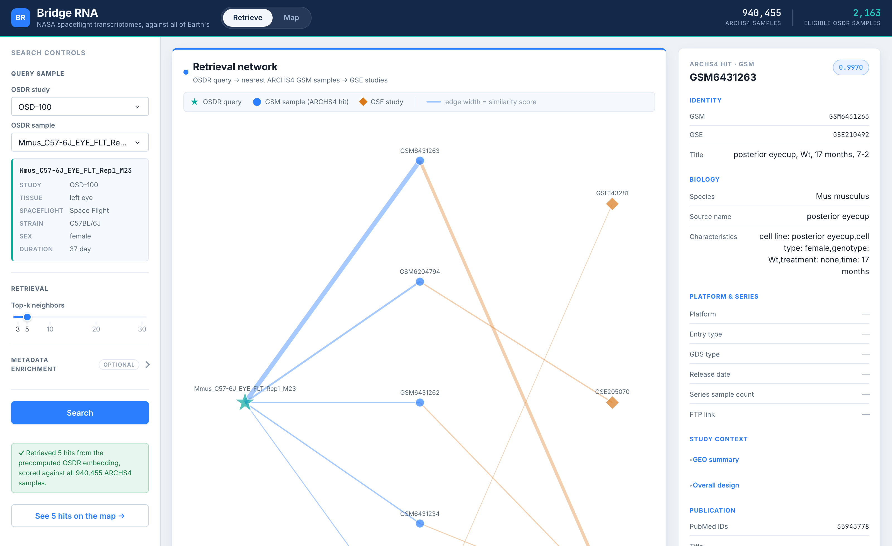
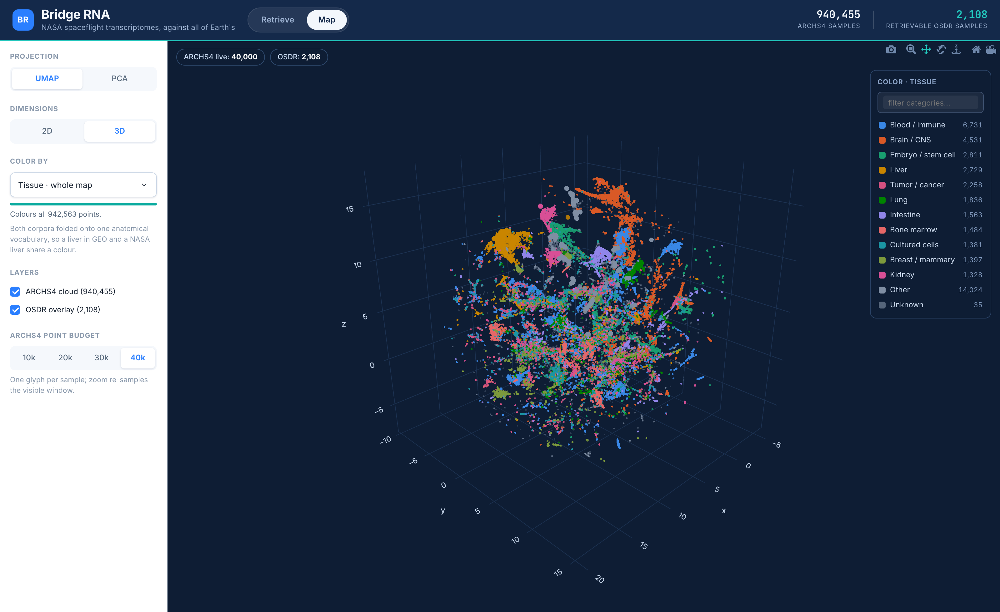

# Bridge RNA

Bridge RNA takes one RNA-seq sample flown on a NASA mission and finds the Earth-based studies whose expression profiles most resemble it, out of the 940,455-sample ARCHS4/GEO collection.
It then shows where that sample and its matches sit in the whole space, as a map of all 942,563 samples.

Developed by the **Space Biosciences Research Branch at NASA Ames Research Center**.

NASA flies rare biology.
A rodent mission returns tens of tissues, not the tens of thousands that terrestrial studies accumulate, and every one of them is expensive, irreplaceable, and hard to interpret in isolation.
The published transcriptome, meanwhile, keeps growing.
Bridge RNA treats a NASA spaceflight sample as a query into that entire corpus, so a tissue flown aboard the International Space Station lands next to the ground studies that look most like it, with no manual literature search and no prior guess about what it should resemble.

## The two views

**Retrieve** (`/`) is the query.
Pick a sample from NASA's Open Science Data Repository (OSDR), and Bridge RNA returns its nearest ARCHS4 neighbours by cosine similarity in a learned 512-dimensional expression space, drawn as a network of hits and the GEO series they belong to, with an inspector and an optional language-model reading.



The screenshot is a real retrieval, and it makes the case better than a description can.
The query is a mouse left-eye sample flown on Rodent Research-1 (OSD-100).
The GEO series it pulls back are all mouse retina studies: sub-RPE deposit accumulation in retinal dystrophy (GSE210492), `Mertk` loss-of-function traits (GSE205070), and the retina transcriptome after `UXT` knockout (GSE143281).

Nothing in the pipeline is told what tissue the query came from.
It found the retina on its own, out of 940,455 candidates, from expression alone.

**Map** (`/map`) is the same space, seen whole.
Both corpora - 2,108 NASA OSDR samples and 940,455 ARCHS4 samples - are reduced into one shared projection and drawn as 942,563 live WebGL points, coloured by a tissue vocabulary defined on both sides.
A retrieval from the first view can be drawn in place on it.



The numbered rings are the same five hits from the screenshot above, at their real positions.
Rings 1, 2 and 4 sit beside the query; 3 and 5 are visibly further away.
That disagreement is the point, and the interface states it rather than hiding it: the ranking is cosine distance in 512 dimensions, and the map is a two-dimensional projection that does not preserve it.
**No line is ever drawn between the query and a hit**, because a line has a length and that length would be read as similarity.
Hovering a ring gives both orderings - its rank by cosine, and its rank by distance on the map.

## How it works

```
NASA OSDR counts → human-ortholog TPM vector → ExpressionPerformer embedding
                 → cosine top-k over the ARCHS4 index → GEO metadata → AI reading
                 → position on the joint PCA/UMAP projection
```

A trained `ExpressionPerformer` model turns a gene-expression vector into a 512-dimensional embedding.
Every ARCHS4 sample was pre-embedded into a memory-mapped index, so a query is one cosine pass over that index.
The mouse query is mapped into human gene space through one-to-one orthologs and normalized (`log1p` of TPM) to match how the model was trained.

**Every query is answered in about half a second**, because all 2,108 retrievable OSDR samples are already embedded and their GEO metadata is already joined locally.
The alternative path - embedding a sample from its counts matrix in a subprocess - takes about 22 seconds and returns less metadata; it is what runs on a clone that has not built the map cache.
The interface always states which path produced an answer.

### What can be retrieved

The OSDR sample list is not uniformly searchable, and the app says so before you click rather than after:

| | samples | behaviour |
| --- | ---: | --- |
| retrievable | 2,108 | precomputed embedding, about half a second, and has a position on the map |
| unavailable | 788 | no path can serve it |

Of the 788, **733 have no spaceflight condition recorded**, which is the filter the embedding pipeline applies before it will consider a sample at all; the other 55 pass that filter but their name matches no column in their study's counts matrix.
They are shown **disabled with the reason** rather than hidden, and the picker never defaults to one.

So every sample that can be retrieved is retrieved in about half a second.
The 22-second path still exists and still works - it is what runs on a clone that has not built the map cache, where all 2,108 fall to it.

## Requirements

- **Python 3.11**, 64-bit.
  Some scientific dependencies do not publish wheels for every Python version, so 3.11 is the supported target.
- **Git** and **Git LFS**.
  The model checkpoint, embedding index, and the raw NASA OSDR count matrices (~2 GB total) are stored in Git LFS.
  Gene annotations, ortholog tables, and the NASA OSDR sample metadata are ordinary Git files and arrive with the clone.
- Optional: a local [Ollama](https://ollama.com) install for the AI reading.
- Optional: the precomputed map cache, which is built locally and is not in the repository.

## Quickstart

### 1. Clone and fetch the large files

```bash
git lfs install
git clone https://github.com/de-jish/bridge-rna.git
cd bridge-rna
git lfs pull
```

`git lfs pull` downloads roughly 2 GB.

Then verify that the large artifacts arrived intact:

```bash
python3 fetch_artifacts.py --verify-only
```

This checks the model checkpoint and embedding index against the SHA-256 digests recorded in `artifacts.json`, and exits non-zero if anything is missing, truncated, or corrupt.
It needs no dependencies beyond the Python standard library, so it can run before the virtual environment exists.

> **If `git lfs pull` fails with a bandwidth or quota error:** this repository's LFS payload exceeds GitHub's free allowance, so cloning may not fetch the large files.
> If that happens, ask the maintainer for the artifact download links, add them to the `url` fields in `artifacts.json`, and run `python3 fetch_artifacts.py` to fetch and verify them directly.

### 2. Create a virtual environment and install dependencies

**macOS / Linux:**

```bash
python3.11 -m venv .venv
.venv/bin/python -m pip install --upgrade pip
.venv/bin/python -m pip install -r requirements.txt
```

**Windows (PowerShell):**

```powershell
py -3.11 -m venv .venv
.\.venv\Scripts\python.exe -m pip install --upgrade pip
.\.venv\Scripts\python.exe -m pip install -r requirements.txt
```

Calling the environment's Python directly avoids activation and execution-policy issues.
The first install is large because it includes PyTorch and PyArrow.

### 3. Run the app

```bash
# macOS / Linux
.venv/bin/python app.py

# Windows
.\.venv\Scripts\python.exe .\app.py
```

Open <http://localhost:8050> and stop the server with `Ctrl+C`.
`/` is the retrieval view and `/map` is the map.

If anything retrieval depends on is missing, the app still starts and shows a banner naming exactly what is wrong and how to fix it, rather than failing only once you press Search.
A clone whose Git LFS payload never arrived is the usual cause.
If the map cache has not been built, `/map` explains which commands build it and retrieval carries on working.

By default the app binds to `127.0.0.1`, so it is reachable only from your own machine, and the debugger is off.
`--host`, `--port`, and `--debug` (or `DASH_HOST`, `DASH_PORT`, `DASH_DEBUG`) change that:

```bash
.venv/bin/python app.py --port 8060      # different port
.venv/bin/python app.py --debug          # hot reload, loopback only
.venv/bin/python app.py --host 0.0.0.0   # expose on your network
```

`--debug` enables the Werkzeug debugger, which runs arbitrary Python for anyone who can reach the port.
Combining it with a non-loopback `--host` is refused rather than warned about.
This is Flask's development server either way, so put a real WSGI server in front of it for anything beyond local or lab use.

### Command-line retrieval

The subprocess path is a standalone script you can also run directly:

```bash
# Random eligible NASA OSDR sample, top-5 hits, on CPU
.venv/bin/python demo_osdr_top5.py --topk 5 --device cpu

# A specific NASA OSDR sample, saving a report
.venv/bin/python demo_osdr_top5.py --osdr-sample-name "<id.sample name>" --save-report-prefix ./reports/run1
```

This script can annotate its hits from the ARCHS4 HDF5 files through `archs4py` (`requirements-optional.txt`), which needs multi-gigabyte downloads from <https://archs4.org/download>.
The app does not need it: `precompute/fetch_archs4_meta.py` obtains the same fields for all 940,455 samples over a JSON API in 35 seconds, and the app reads them from the local cache.

## Building the map

The map is drawn from precomputed coordinates rather than computed on demand, so it needs a one-time build.
Retrieval works without it; only `/map` and the cached fast path depend on it.
Order matters, because the metadata fetch joins positionally onto the identity table the projection build writes.

```bash
PY=.venv/bin/python

$PY precompute/embed_osdr.py                     # OSDR embeddings, gene-digest gated. Hours; resumable.
$PY precompute/build_projections.py              # full-corpus PCA + UMAP. ~10.5 min.
$PY precompute/fetch_archs4_meta.py              # ARCHS4 GEO metadata. ~35 s, needs network.
$PY precompute/validate_artifacts.py --mixing --quality   # gates the build; exits nonzero on failure
```

Both reductions are fit on **every one of the 942,563 points**, not on a subsample: the PCA is an exact eigendecomposition taken from one streaming pass, and the UMAP is a direct fit rather than a landmark fit with the rest pushed through `.transform()`.
Vectors are L2-normalized first, because raw ARCHS4 norms span 6.7 to 26.4 and PC1 would otherwise be a magnitude axis.

`validate_artifacts.py --quality` is the check a structural pass cannot give you.
Row counts and finite coordinates are satisfied by any set of numbers, so `--quality` scores each coordinate set on how well it preserves the 512-dimensional space it came from - 15-NN recall against the exact neighbours, and 25-NN tissue purity - each against a null that says what the number would be if the map carried no information.
`--compare DIR` scores a candidate build against the shipped one on the same sample.

`fetch_archs4_meta.py` deserves a note, because the obvious route is a trap.
ARCHS4's per-sample metadata lives in gene-level HDF5 files that are 62.3 GB for human and 50.7 GB for mouse.
The Maayan Lab sigpy JSON API returns the same fields in bulk: measured on the real corpus, 33.7 seconds, 39 requests, 216 MB, and 99.911% of all 940,455 accessions resolved.
The 839 that do not resolve are present in the release-matched v2.5 metadata and absent from the newer release the API serves; they get tissue "Unknown" rather than being dropped or guessed at.

### Run the map before the data exists

The real cache takes hours to build.
To exercise the interface immediately, build a synthetic corpus of the same shape:

```bash
.venv/bin/python tests/build_dev_corpus.py --out /tmp/bm-dev --archs4 60000 --osdr 2000 --clean
BRIDGE_RNA_ROOT=/tmp/bm-dev/bridge_rna MANIFOLD_CACHE_DIR=/tmp/bm-dev/cache .venv/bin/python app.py
```

The numbers are synthetic - shaped like the real corpus, with real cluster structure, but meaningless biologically.
It exists to test the instrument, not to be read.

## Tests

```bash
.venv/bin/python -m pytest tests/ -q        # 193 tests, about two seconds
.venv/bin/python tests/e2e_check.py         # 29 browser checks, about a minute
```

The pytest suite builds its own synthetic corpus in a temp directory and never touches the 963 MB memmap or the checkpoint, so it runs on a machine that has neither.
Its fixture is generated from known latent clusters with metadata derived from those clusters, which gives the render tests real category structure to assert against rather than noise.

One check deliberately sits outside pytest, because a green suite says nothing about whether 942,563 WebGL glyphs actually reach a browser.
`tests/e2e_check.py` boots the real app against the real cache, drives Chromium, and asserts on what the page reports about itself: that the default view really draws all 942,563 points, that each budget tier draws exactly the count it advertises, and that the console is clean.
It needs the built cache, so it is a local check rather than something a fresh clone can run.

```bash
.venv/bin/python tests/check_join.py         # the cross-view join, on real data
```

`check_join.py` asserts on the real 942,563-point corpus what the pytest suite asserts on its fixture: that every point the map rings is the sample the retrieval actually returned.
Nothing but arithmetic enforces that, and if it ever drifts the map would keep drawing rings, just around the wrong samples.

## Configuration

The app runs with no credentials.
All configuration is read from environment variables in the process that starts the app; nothing is loaded from a file automatically.
See `.env.example` for the common ones, and never commit real keys.

### AI readings (Ollama, default)

The AI panel uses a local Ollama server by default, which needs no account or API key.
The default model is `gemma3:4b`.

```bash
brew install ollama
brew services start ollama
ollama pull gemma3:4b
```

The app connects to `http://127.0.0.1:11434` automatically.
Set `OLLAMA_MODEL` to use a different installed model, or `OLLAMA_BASE_URL` for a remote server.
If no Ollama server is reachable, retrieval and the rest of the interface still work and the panel says what to install.

### Optional GEO and PubMed enrichment (NCBI)

A retrieval arrives with each hit's GEO series, title, source name, characteristics, and tissue, all from the local cache.
Study abstracts, overall design, and PubMed records are not in that cache, and are fetched from NCBI Entrez when you open a hit or ask for an AI reading.
Fetching them for every hit during the search is a checkbox, off by default, because it turns a 0.6-second search into an 11-second one for text most searches never open.

NCBI asks callers to identify themselves:

```bash
export ENTREZ_EMAIL="you@example.com"
export NCBI_API_KEY="your-key"   # optional, raises the rate limit
```

### Optional AWS Bedrock backend

Set `BEDROCK_API_URL` (and `BEDROCK_API_KEY` if your gateway requires one) to route AI readings through an API-Gateway-fronted Bedrock endpoint instead of Ollama.

## Project layout

| Path | What it is |
| --- | --- |
| `app.py` | The only entry point: shared header, router, both views on port 8050. |
| `bridge_rna/` | The retrieval half: config, preflight, OSDR loading, retrieval, GEO enrichment, AI, figures, panels, layout, callbacks. |
| `manifold/` | The map half: paths, artifact loaders, the tissue vocabulary, the coverage-aware color-by registry, the layered renderer. |
| `precompute/` | Offline jobs that build the map cache, plus the validator that gates a build. |
| `tests/` | 193 pytest tests over a synthetic corpus, plus the browser and join checks. |
| `assets/` | Stylesheets, layered by load order: tokens, shell, retrieve, map. |
| `demo_osdr_top5.py` | The subprocess retrieval path, also usable as a CLI. |
| `generate_archs4_embeddings.py` | `ExpressionPerformer` and the batch job that builds the embedding index. |
| `slim_performer_model.py`, `numerator_and_denominator.py` | Linear-attention backend, used only for non-flash checkpoints. |
| `osdr_metadata.py` | Client for the NASA OSDR REST API. |
| `fetch_artifacts.py` | Downloads and checksum-verifies the large artifacts in `artifacts.json`. |
| `checkpoints_performer/` | Trained model checkpoint (Git LFS). |
| `archs4_sample_embeddings_full/` | Precomputed ARCHS4 embedding index and metadata (Git LFS). |
| `cache/` | The map's precomputed artifacts. Built locally; not in the repository. |
| `data/archs4/train_orthologs/canonical_genes.csv` | Authoritative gene list (15,165 genes) defining expression-vector row order. |
| `data/` | NASA OSDR counts (`osdr/raw/`, Git LFS) plus sample metadata, orthologs, and gene annotations. |
| `docs/` | README images and the map's own documentation. |
| `prompts/` | The AI prompt template. |

Further documentation: [`docs/manifold.md`](docs/manifold.md) for the map in depth, `IMPLEMENTATION.md` for the map's design decisions and tradeoffs, `REFERENCE.md` for verified ground-truth measurements, and `progress.md` for the running status log.

## Architecture

Everything expensive is precomputed once and cached; the serving app only ever loads artifacts.
UMAP over 942,563 points is a job measured in tens of minutes, which is not something to do inside a callback.

The map opens no embeddings and computes no statistics, so its dependency surface is `dash`, `plotly`, `numpy`, `pandas`, and `pyarrow` - nothing scientific.
Nothing in the serving path imports `torch` at module scope, so the app starts without it and the map works on a machine with no model at all.

**The two halves share an exact index join**, which is what makes the integration free rather than a translation layer:

- An OSDR sample is the same key on both sides, `"<accession>|<sample name>"`.
- An ARCHS4 hit's row in the embedding memmap **is** its point index on the map, because ARCHS4 occupies the first 940,455 rows of the map's global point order.

Both are pinned by tests, because neither is enforced by a schema.

**`generate_archs4_embeddings.py`** defines `ExpressionPerformer`, the deployed model, along with the batch job that writes the embedding memmap, `sample_locations.parquet`, and `embedding_manifest.json`.
Two attention backends are selected by the checkpoint's `feature_type`: `flash` (PyTorch SDPA) or a SLiM/Performer linear-attention layer imported lazily.
The deployed checkpoint uses `flash`.

Rebuilding the index from sharded parquet is a GPU-scale batch job and is rarely run locally:

```bash
.venv/bin/python generate_archs4_embeddings.py \
  --checkpoint checkpoints_performer/r7hnr92k/best_model.pt --overwrite
```

### Implementation notes

**Species mapping is central.**
The NASA OSDR samples here are mouse, flown on rodent missions, and the model operates in human gene space.
Crossing that species boundary is what lets a flight tissue be compared against human ground studies at all.
`build_mouse_to_human_maps` uses `data/ensembl/orthologs_one2one.txt`, restricted to one-to-one orthologs, to map mouse Ensembl IDs onto human gene symbols, then reindexes onto the canonical gene list.

**Normalization has to match the checkpoint.**
Counts are converted to TPM using mouse exon lengths from `data/gencode/`, then `log1p`.
The checkpoint's `normalization` field is `log1p_tpm`, and query-side normalization must reproduce it exactly or the embeddings will not align.

**Embeddings are stored un-normalized.**
The manifest records `l2_normalize: false`, and L2 normalization is applied at search time, so cosine similarity equals the dot product once both sides are normalized.

**Index facts.**
940,455 samples, 512 dimensions, float16 memmap, `feature_type: flash`.
The paths recorded inside `embedding_manifest.json` point at the original training host and should be ignored; everything resolves relative to the repository root at runtime.

## The canonical gene list

The model consumes a fixed-length expression vector whose row order is defined by a canonical gene list, at `data/archs4/train_orthologs/canonical_genes.csv`.
This matters more than it sounds: `ExpressionPerformer` indexes its `gene_embedding` table by *position*, so slot `i` of the vector simply is gene `i`.
The model carries no other notion of which gene a slot holds.

A list with the right length but the wrong order therefore pairs every gene's learned embedding with a different gene's expression value.
The resulting cosine scores still land in a plausible range and every visualization still renders, so the failure is silent by construction.

That is not hypothetical.
This repository previously shipped without the real list and fell back to a stand-in synthesized from the checkpoint's gene count.
It agreed with the true ordering on **18 of 15,165 positions**, and every retrieval published before the list was restored was meaningless.

The list is now present and committed as an ordinary Git file (no `git lfs pull` needed).
Its integrity is pinned by content rather than by path: `CANONICAL_GENES_SHA256` in `generate_archs4_embeddings.py` records the SHA-256 of the gene ordering, and both entry points hash the list they load and compare.
A stand-in, a corrupted copy, or a wrong-order file sitting at the authoritative path all fail that check, and the app shows a banner saying results are not scientifically valid.
Checking the path instead of the content was the original blind spot, so the check is deliberately content-based.

The same gate guards the precomputed OSDR embeddings: `precompute/embed_osdr.py` asserts the digest before it embeds anything, so the fast retrieval path cannot be served by vectors built in a different gene space.

## Reading the map honestly

Three properties of the map are disclosed in the interface, not buried here, because each one is a way it could be misread.

**UMAP distance is not quantitative.**
Cluster sizes and the gaps between them do not carry a magnitude.
This is why no line is drawn between a query and its hits.

**The two corpora were embedded on different hardware and in different precisions.**
Controlling for both study and tissue, OSDR samples that share neither still neighbour each other 54 times above chance.
Tissue is the dominant axis of bulk expression, so biology cannot explain that: some of the distance between the corpora is technical.
Compare within a corpus, not across it.
`precompute/validate_artifacts.py --mixing` recomputes that number exactly.

**A colour-by never paints a corpus it cannot describe.**
Several fields - spaceflight arm, strain, habitat - exist only for the 2,108 OSDR samples.
Selecting one used to paint the other 940,455 points a flat grey, which reads as "these were measured and have no structure here" rather than "this field says nothing about them".
Those points are now drawn as faint context with no legend row, and the menu labels every field with the share of the map it actually covers.

## Known limitations

- 788 of the 2,896 listed OSDR samples cannot be retrieved at all: 733 have no spaceflight condition recorded, and 55 match no column in their study's counts matrix. They are disabled in the picker with the reason rather than hidden.
- 882 ARCHS4 samples carry tissue "Unknown" on the map: 839 the metadata API could not resolve (0.089% of the corpus), plus 43 it resolved but whose free text named no tissue. None are guessed at.
- `demo_osdr_top5.py` loads the entire embedding index into memory (~1.9 GB, ~3.9 GB peak). The app streams the index in chunks and does not have this problem.
- The interface loads webfonts from `fonts.googleapis.com`, so first paint needs network access.
- The AI reading is generated by a small local model and is a starting point for interpretation, not a result.

## Licensing

The **code** in this repository is released under the [MIT License](LICENSE).

The **bundled data is not covered by that license** and carries its own terms.
The spaceflight data is from NASA's [Open Science Data Repository (OSDR)](https://osdr.nasa.gov/), NASA's open repository for space biology and life sciences data.
ARCHS4 is from the [Ma'ayan Lab](https://maayanlab.cloud/archs4/).
Gene annotations come from [Ensembl](https://www.ensembl.org/) and [GENCODE](https://www.gencodegenes.org/).
Review the terms of each source before redistributing the bundled data.

## Citing

If you use Bridge RNA in published work, see [`CITATION.cff`](CITATION.cff).
GitHub renders it as a "Cite this repository" link in the sidebar.

Bridge RNA was developed by the Space Biosciences Research Branch at NASA Ames Research Center, which studies how living systems respond to the space environment.
